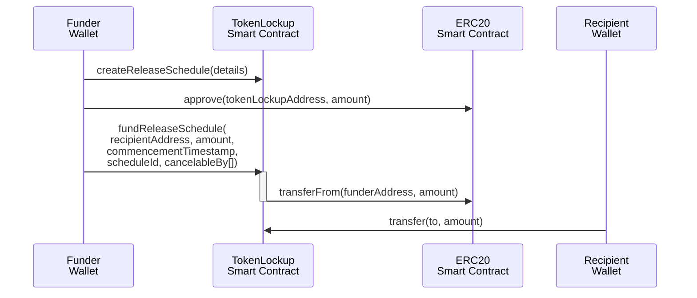

# OPGAMES_Token_Engineering

### Contracts

The project will include these smart contracts:

|  Contract  |  Deployed To  |
| --- | --- |
|  ERC20Token  |  Polygon Mainnet, Ethereum Mainnet and Avalanche Mainnet  |

### High Level Architecture


### ERC-20 Token Details

- Deployment Blockchains: **Polygon**, **Ethereum**, **Avalanche**
- Token Smart Contract Format: **ERC20**
- Token Name: Arcadia
- Token Symbol: ARCD
- Initial Minted Supply: **`1,000,000,000`**
- Fixed Supply Cap: Yes
- Token Decimal: `18`
- Burnable: Yes
- Governance Compatible: Yes

## Project Setup

* Clone this repository
* Run `yarn install` to install all the dependencies
* Run `yarn test` to run all the tests

## Testnet Deployment

* Run `yarn deploy:mumbai` to deploy the contracts mumbai testnet
* Run `yarn deploy:sepolia` to deploy the contracts sepolia testnet
* Run `yarn deploy:fuji` to deploy the contracts fuji testnet
* Run `yarn deploy:goerli` to deploy the contracts goerli testnet

## Mainnet Deployment

* Run `yarn deploy:polygon` to deploy the contracts polygon mainnet
* Run `yarn deploy:ethereum` to deploy the contracts ethereum mainnet
* Run `yarn deploy:avalanche` to deploy the contracts avalanche mainnet

## Test Coverage Report:

* Run `yarn test` to run a unit test cases on the contracts.
* Run `yarn coverage` to generate a code coverage report for the contracts.

## Deployment Flow:

1. Deploy the ERC20 token on the base chain (Chain of your choice which acts as Parent chain)
2. Deploy the ERC20 token on the child chains (All the layer 2 child chains)
3. The contract address configuration is updated dynamically. 
4. Use the config file to run the `register-truted-remote.js` script to register the remote chains to each other. (Customize this script based on the needs)
5. Distribute the total supply across different chains using the `send-token.js` script. (Customize the scripts based on the needs)
6. Deploy the Token lockup contract in the base chain to support token vesting to controll the circulating supply

<div style="page-break-after: always;"></div>

# TokenLockup Smart Contract

## Overview

Smart contract enforced lockup schedules are used to control the circulating supply instead of minting. Lockups are applied to investors and other token holders at the time of transferring tokens.

The lockup period implementation lowers gas fees by referring to common release schedule tables and using unlock calculations that do not require updating smart contract state for time dependent lockups.

## Usage Sequence



1. The Funder Wallet calls `createReleaseSchedule(...)` to define a reusable vesting schedule (described in depth below).
2. The Funder Wallet calls `approve(tokenLockupAddress, amount)` on the ERC-20 token contract. This will allow the TokenLockup contract to transfer tokens to the control of the TokenLockup smart contract in the next step. This is a standard usage pattern for ERC-20 tokens.
3. The Funder Wallet calls:<br>`fundReleaseSchedule(recipientAddress, amount,commencementTimestamp,scheduleId, cancelableBy[])`<br>which transfers tokens from the ERC-20 contract to the control of the tokenLockup. The tokens will be available to the recipient on the unlock schedule defined by the specified `scheduleId` beginning on the `commencementTimestamp`.
4. The Recipient Wallet can call `transfer(to, amount)` on the TokenLockup smart contract to transfer a portion of their unlocked tokens to any recipient that they specify.

## Define A Release Schedule

Lockup period schedules may be configured and funded without a central admin role and from any address. This empowers reserve managers, crowdfunding portals and others to enforce on chain lockup schedules.

Anyone can create release schedule. Schedules can be reused with different commencement dates and amounts.

```solidity
function createReleaseSchedule(
    uint releaseCount, // total number of releases including any initial "cliff'
    uint delayUntilFirstReleaseInSeconds, // "cliff" or 0 for immediate relase
    uint initialReleasePortionInBips, // in 100ths of 1%
    uint periodBetweenReleasesInSeconds
)
external
returns (uint unlockScheduleId)
```

When a release schedule is created it emits an event with the `scheduleId`
```solidity
event ScheduleCreated(address indexed from, uint scheduleId);
```

### Implementation Details

* The date is in unix timestamp format. The unlock time granularity is intended to be days roughly. The roughly 900 second blocktime variance for Ethereum block timestamp should be expected. However it is not an issued for a time specificity tolernace of roughly days.
* The percentage is stored as 100ths of a percent - bips. The maximum specificity is multiple of 0.0001 represented as uint `1` bip.

## Example Release Schedule

Here's an example of creating a release schedule using the Ethereum Ethers.js library:

```javascript
await tokenLockup.connect(reserveAccount).createReleaseSchedule(
    4, // total number of releases including any initial "cliff'
    0, // 0 time delay until first release (immediate release)
    800, // the initial portion released in 100ths of 1%
    (90 * 24 * 60 * 60) // time between releases expressed in seconds = 90 days
)

// returns id 1 after creating the release schedule
```

This is an example of funding the release schedule for a specific recipient:

```javascript
await tokenLockup.connect(reserveAccount).fundReleaseSchedule(
    recipient.address,
    100,
    Math.floor(Date.now() / 1000), // the commencement date unix timestamp in seconds
    1 // scheduleId
)
```

## Funding A Release Schedule

A transfer can reference a release `scheduleId` to fund for a recipient. The release schedule controls when tokens will be unlocked calculated from a commencementTimestamp in the past, present or future. This flexible scheduling allows reuse of schedules for promises that may have been made during project formation, a funding event or that exist in legal documents.

```solidity
function fundReleaseSchedule(
    address to,
    uint amount,
    uint commencementTimestamp, // unix timestamp
    uint scheduleId,
    address[] memory cancelableBy
) public returns (bool success)
```

## Cancelable TimeLock "Vesting"

If the release schedule is not cancelable (like investor lockups that cannot be reclaimed from the investor) then the `fundReleaseSchedule(..., address[] memory cancelableBy)` should just be an empty array `[]`.

If the release schedule is cancelable (like employee token vesting conditional on employment) then `fundReleaseSchedule(..., address[] memory cancelableBy)` should include the addresses that can cancel the recipients timelock to reclaim the remaining locked tokens. The tokens that are unlocked cannot be reclaimed, they can only be transferred by the recipient address.

### Vesting Cancelation Example

GIVEN the release schedule was funded with
```solidity
tokenLockup.fundReleaseSchedule(
    recipientAddress,
    100,        // amount
    yesterday,  // commencementDate
    1,          // schedule id 
    [cancelorAddress]
);
```

AND today the timelock's release schedule `1` dictates that `51` of the `100` tokens are unlocked
AND `49` of the tokens are still locked
WHEN the `cancelorAddress` owner cancels the timelock with
```solidity
tokenLockup.cancelTimelock(
        recipientAddress,
        timelockIndex,
        reclaimTokenToAddress // where reclaimed tokens will go
    );
```

THEN the `51` unlocked tokens are transferred to the `recipientAddress`
AND the `49` locked tokens are transferred to the `reclaimTokenToAddress`
AND the `timelock.tokensTransferred == timelock.totalAmount`
AND the number of funded tokens still in the contract is `0`

There are a lot more usage examples in the `tests` folder.

## Transferring Unlocked Tokens

In the release schedule funding example above, tokens can be transfered by the `recipient` account using the `transfer()` function. Their tokens are unlocked on this schedule:

| Release Schedule                                             | Percentage (bips)               | Release # | Amount    |
| ------------------------------------------------------------ | ------------------------------- | --------- | --------- |
| 2021-06-01 (commencementDate <br />+ 0 delayUntilFirstReleaseInSeconds) | 8%                              | 1         | 8         |
| + 90 days                                                    | 30.66%                          | 2         | 30.66     |
| + 180 days                                                   | 30.66%                          | 3         | 30.66     |
| + 270 days                                                   | 30.66% + 0.01 remainder | 4         | 30.67     |
| ***Total***                                                  | ***100%***                      |           | ***100*** |

#### Remainders

In the process of calculating the lockup, some rounding errors may occur. These rounding remainder amounts are typically of very small value with a token between 8 and 18 decimal places. 

To unlock the exact number of tokens needed for the final lockup period in the schedule, the final scheduled amount is for all tokens that have not yet been unlocked in the unlock  schedule.

## Transferring Released Tokens

Transfers can be done with an ERC20 style transfer interface that will transfer all unlocked tokens for all schedules belonging to the message sender.

```solidity
transfer(to, amount)
```

* the `transfer()` and `transferFrom`()  have the standard ERC20 interface to make it easy to use MetaMask and other tooling.
* Lockup periods are checked and enforced for any transfer function call.

## Checking Total Balances

These functions allow you to check total locked and unlocked tokens for an address:

```solidity
function balanceOf(address who) external view returns (uint256);
```

Check just the locked tokens for an address:

```solidity
function lockedBalanceOf(address who) external view returns (uint256);
```

Check just the unlocked tokens for an address:

```solidity
function unlockedBalanceOf(address who) external view returns (uint256);
```

Check the total number of tokens stored in the smart contract:

```solidity
function totalSupply() external view returns (uint256);
```

### Specific Release Schedule Balances

Check total locked and unlocked tokens for an address:

```solidity
function viewTimelock(address who, index) external view returns (uint amount, uint scheduleId, uint commencementDate, uint unlockedBalance, uint lockedBalance);
```

## Griefer Protection

"Griefing" is bad faith use of a system to enrage, troll or cause damage to other users. The contract has no centralized control and implements self service functions to avoid possible griefing attacks by other contract users. 

The primary predicted griefing attack vector would be overloading recipients with spam release schedule timelocks. To avoid this the contract makes this attack costly. To avoid this issue the following protections are available.

### Minimimum Release Schedule Amount

To avoid increasing computation requirements, gas cost for transfers and exceeding max gas for a transaction, each transferWithRelease schedule amount must be for an amount of tokens `> minReleaseScheduleAmount`.

Each release period must also release at least one token. Release periods can be as small as one second since they are calculated and do not require storage updates on the blockchain until the time of transfer.

### Individual Schedule Transfer

To avoid the possibility that a a recipient might have too many release schedules to calculate in the transfer function, individual release schedules can be separately transferred with:

```solidity
function transferTimelock(address to, uint value, uint timelockId) public returns (bool) 
```

## Gas Optimization

To reduce gas fees, reusable schedules are referenced by a single ID. Unlocked tokens are calculated using a formula. This keeps each transfer from requiring it's own vesting schedule data storage and drops the number of SSTORE values required.

## Batch Transfers

Batch transfer functions can significantly lower the cost of making many transfers.

There is a `batchTransfer` function suitable for use with any ERC20 token in the `BatchTransfer.sol`
```solidity
function batchTransfer(IERC20 token, address[] memory recipients, uint[] memory amounts) external returns (bool) 
```

And a `batchFundReleaseSchedule()` is part of the `TokenLockup.sol` contract:

```solidity
function batchFundReleaseSchedule(
    address[] memory to,
    uint[] memory amounts,
    uint[] memory commencementTimestamps,
    uint[] memory scheduleIds,
    address[] memory cancelableBy
) external returns (bool success)
```

